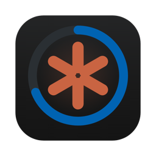

<p align="center">
  
</p>

<h1 align="center">ClaudeBar</h1>

<p align="center">
  Your Claude usage limits, in the macOS menu bar, in your timezone.
</p>

<p align="center">
  <a href="https://github.com/GordonBeeming/claude-bar/actions/workflows/build.yml"></a>
  <a href="https://github.com/GordonBeeming/claude-bar/releases/latest"></a>
  
</p>

---

ClaudeBar shows your Claude plan's usage limits in the menu bar — the same numbers you'd find on Claude's usage page, nothing more. The bar shows the highest percentage across your limits; the dropdown lists each one: session (5h window), weekly across all models, and any model-scoped limits like Fable or Sonnet, each with a progress bar and its reset time in your local timezone.

That's the whole app. No cost tracking, no charts, no extras. The menu renders instantly from cached data and refreshes in the background.

## Install

```sh
brew install --cask gordonbeeming/tap/claude-bar
```

Needs macOS 15+ on Apple Silicon, plus [Claude Code](https://claude.com/claude-code) installed and logged in — ClaudeBar reads its OAuth token from the Keychain (read-only; click **Always Allow** when macOS asks). It never writes or refreshes the token; that's Claude Code's job. If the token expires, ClaudeBar keeps showing the last known numbers with a hint to open Claude Code. macOS reasks for that Keychain permission every so often — [Keychain access](#keychain-access) explains why.

### From source

```sh
make install
open ~/Applications/ClaudeBar.app
```

`make install` signs with your Apple Development identity when one exists, falling back to ad-hoc. Ad-hoc mints a fresh signing identity every build, so the Keychain prompt comes back after each rebuild; a real identity keeps the grant forever.

## Settings

Open **Settings…** from the dropdown:

- **Usage colours** — by default the icon turns orange/red when Claude's API says a limit is at warning/critical. Untick *Use Claude's severity levels* and you get a blue → orange → red bar: drag the two splitters to pick your own warning and critical percentages.
- **Launch at login** — on by default, toggle it here.

## How it works

ClaudeBar polls `GET https://api.anthropic.com/api/oauth/usage` (once a minute, plus on menu open when stale) with the Claude Code OAuth token, and renders the `limits` array it gets back — one row per limit with percent used, a progress bar, and "Resets 5:00 pm · in 4h 55m" converted from UTC to your system timezone. The app is an accessory (no Dock icon, no app switcher entry); it just lives in the menu bar.

## Keychain access

ClaudeBar reads one Keychain item — Claude Code's `Claude Code-credentials` — to get the OAuth token the usage endpoint needs. It only reads: never writes the item, never refreshes the token, never touches the refresh token.

macOS gates that read behind a consent prompt. Click **Always Allow** and macOS trusts ClaudeBar for that item — until Claude Code next rotates its token. Claude Code refreshes its OAuth token a couple of times a day, and every refresh rewrites the Keychain item, which clears the item's list of trusted apps. So the prompt comes back and you grant it again. It isn't a bug in ClaudeBar or a setting that didn't save; macOS treats a rewritten item as new and re-checks who's allowed to read it.

Both ways to stop the prompt are worse than living with it:

- **Refresh the token ourselves**, so ClaudeBar never depends on Claude Code's item. Anthropic's refresh tokens are single-use — refreshing rotates the token and invalidates the copy Claude Code is holding, which logs the CLI out and forces you to sign in again. A repeat click beats breaking Claude Code. (A sibling menu bar app hit exactly this: [CodexBar #1161](https://github.com/steipete/CodexBar/issues/1161).)
- **Cache the token in memory**, so ClaudeBar reads the Keychain far less often. That leaves a live credential sitting in memory longer than any one request needs it, which widens the window for a memory dump to lift it. Not a trade worth making to skip a click.

So ClaudeBar reads on each poll, stays read-only, and wears the occasional prompt. Clicking **Always Allow** each time it reappears is the intended flow.

## Dev loop

```sh
make run    # swift run, straight from source
make test   # swift test — core logic is fully unit-tested
```

The core library (`ClaudeBarCore`) holds everything testable: ISO8601 parsing, timezone formatting, severity thresholds, JSON decoding that survives unknown limit kinds. The app target is a thin SwiftUI `MenuBarExtra` on top.

## Releasing

Tag `vX.Y`, publish a GitHub release for it, and CI does the rest: signs with Developer ID, notarizes, staples, uploads the DMG, and pushes the updated cask to [the tap](https://github.com/GordonBeeming/homebrew-tap) so `brew upgrade --cask gordonbeeming/tap/claude-bar` picks it up.
